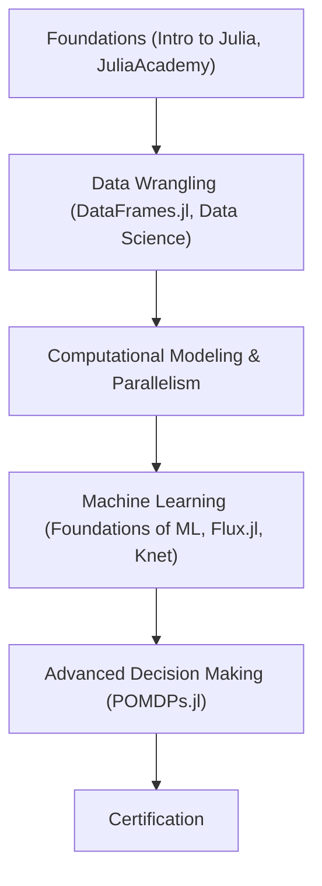

# Technical Specification: Julia Programming Challenge

## Architectural Overview

**Julia Programming Challenge** is a structured, linear progression architecture designed to systematically build computational science and machine learning competency through a rigorous curriculum. The project serves as a comprehensive study into the **Julia Ecosystem**, bridging the gap from foundational syntax to high-performance parallel computing and advanced neural architectures.

### Learning Logic Flow

---

## Technical Implementations

### 1. Core Computational Engine
-   **Runtime Environment**: Built on **Julia 1.6+ (LTS)** or later, leveraging the language's native strengths in numerical analysis and high-performance computing.
-   **Multiple Dispatch**: Emphasizes Julia's unique paradigm of multiple dispatch to ensure type-stable, highly extensible, and performant code across all computational modules.

### 2. Modules & Libraries
-   **Data Wrangling**: Implements **`DataFrames.jl`** and **`CSV.jl`** for high-velocity data cleaning, transformation, and tabular data management.
-   **Neural Architectures**: Utilizes **`Flux.jl`** and **`Knet.jl`** to construct and train complex deep learning models using automatic differentiation.
-   **Modeling & Simulation**: Deploys specialized frameworks for stochastic modeling and decision making under uncertainty (**`POMDPs.jl`**).

### 3. High-Performance Framework
-   **Parallelism**: The repository structures formal workflows for **Parallel Computing**, including multi-threading and distributed computing patterns native to the Julia runtime.
-   **Performance Optimization**: Integrates JIT (Just-In-Time) compilation strategies and type-inference techniques to achieve C-like performance with Python-like productivity.

---

## Technical Prerequisites

-   **Runtime**: Julia 1.6.0 or higher ([JuliaLang](https://julialang.org/downloads/)).
-   **Development**: VS Code with the [Julia Extension](https://ext.julia.vscode.org/).
-   **Dependencies**: Valid `Pkg.activate()` and `Pkg.instantiate()` synchronization for the project environment.

---

*Technical Specification | Julia Language | Version 1.0*
